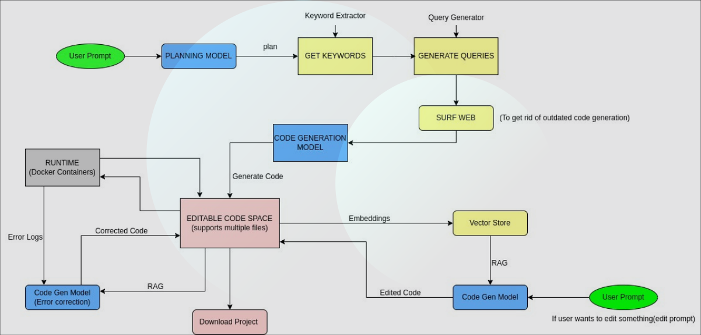

# DevForge

Welcome to DevForge, an advanced AI-powered Web-based development platform. DevForge combines intelligent code generation with seamless runtime management to create a powerful, efficient development environment.


## Core Purpose
DevForge transforms natural language task descriptions into functional code while providing an integrated environment for execution, testing, and debugging. The platform aims to accelerate development workflows by automating routine coding tasks while maintaining developer control and code quality.


## ⚡ Workflow Process

### Task Input

Developers describe their requirements in natural language
System analyzes and understands development context
Requirements are processed for code generation


### Code Generation

AI model generates appropriate code based on requirements
Code is optimized for best practices
Multiple language support based on project needs


### Execution Environment

Code is automatically deployed to appropriate Docker containers
Runtime environment is configured based on requirements
Secure and isolated execution environment is maintained


### Developer Interaction

Direct access through SSH console
Real-time output monitoring
Interactive debugging capabilities
Immediate feedback loop


### Error Resolution

Automatic error detection and logging
Error analysis and suggestion generation
Continuous improvement through feedback

## 🏗️ Architecture
</img>


## 🚀 Getting Started

run the server

```bash
python main.py
```
run the frontend
```bash
cd frontend
npm start
```

## 💻 Demo

[](https://app.supademo.com/demo/cm772cy1l0iphqao1s6y5e8vo)

## 🤝 How to Contribute
We welcome contributions from developers of all skill levels

## 📜 License
Distributed under the MIT License.

